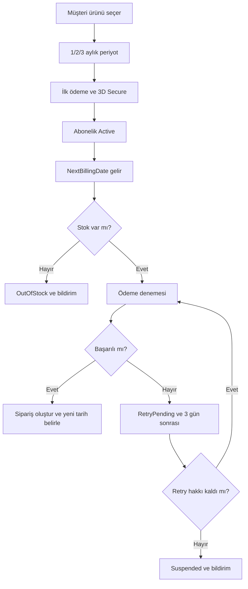
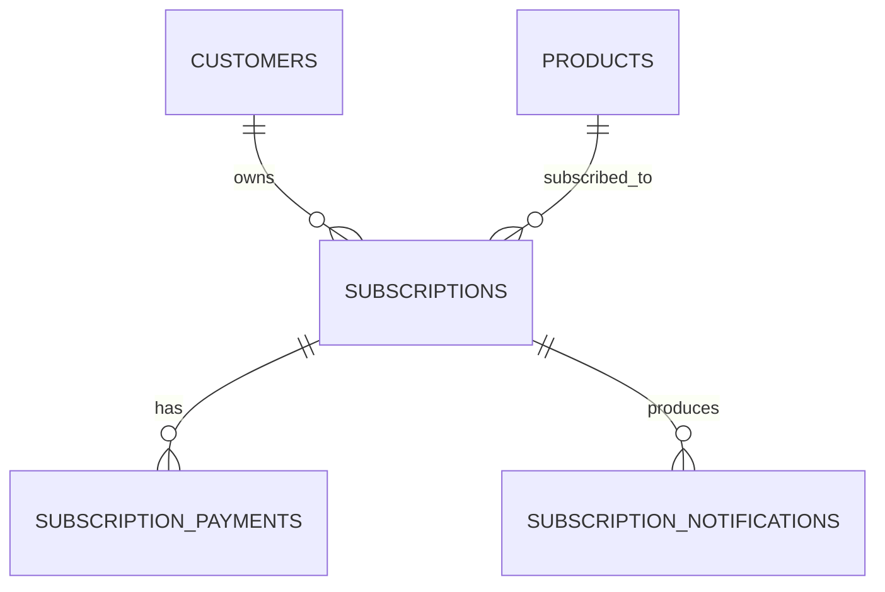

# Abonelik Siparişi — BA Vaka Çalışması

## Problem ve amaç

Müşteriler düzenli satın aldıkları ürünleri her seferinde manuel sipariş etmektedir. Amaç; 1, 2 veya 3 aylık periyotlarla otomatik sipariş ve ödeme oluşturan, müşterinin duraklatıp iptal edebildiği güvenilir bir abonelik deneyimi tanımlamaktır.

> Eğitim amaçlı kurgusal senaryodur. Başarı hedefleri öneridir; gerçekleşmiş sonuç değildir.

## Kapsam

| Dahil | Hariç |
|---|---|
| Periyot seçimi, kayıtlı kart, otomatik sipariş | VIP ve taahhütlü abonelik |
| Ödeme retry, stok kontrolü, bildirim | Ödül/sadakat sistemi |
| Pause/resume/cancel ve admin görünümü | Mobil uygulamaya özel geliştirme |

## Süreç



## Gereksinimler

| ID | Gereksinim | Öncelik |
|---|---|---|
| SUB-FR-01 | Müşteri uygun üründe 1/2/3 aylık abonelik oluşturabilmelidir. | Must |
| SUB-FR-02 | Sistem ödeme tarihinde stok kontrolü sonrası otomatik sipariş oluşturmalıdır. | Must |
| SUB-FR-03 | Başarısız ödeme 3 gün sonra, en fazla 3 kez denenmelidir. | Must |
| SUB-FR-04 | Stok yokluğu retry hakkını tüketmemelidir. | Must |
| SUB-FR-05 | Müşteri aboneliği duraklatabilmeli, devam ettirebilmeli ve iptal edebilmelidir. | Must |
| SUB-FR-06 | Kritik durumlarda kullanıcıya bildirim gönderilmelidir. | Should |
| SUB-NFR-01 | Abonelik oluşturma isteğinin %95'i 3 saniye içinde tamamlanmalıdır. | Must |
| SUB-NFR-02 | Kart bilgileri açık metin olarak saklanmamalıdır. | Must |

## User stories ve Gherkin

### SUB-US-01 — Abonelik oluşturma

**Bir müşteri olarak**, düzenli aldığım ürüne abonelik oluşturmak istiyorum; **böylece** her seferinde manuel sipariş vermem gerekmez.

```gherkin
Given müşteri giriş yapmıştır ve ürün aboneliğe uygundur
When müşteri periyodu seçip ilk ödemeyi doğrular
Then abonelik "Active" olmalıdır
And bir sonraki ödeme tarihi hesaplanmalıdır
```

### SUB-US-02 — Başarısız ödeme

```gherkin
Given aktif aboneliğin ödeme tarihi gelmiştir
And ürün stoktadır
When kayıtlı karttan ödeme alınamaz
Then abonelik "RetryPending" olmalıdır
And retry tarihi 3 gün sonrası olmalıdır
And kullanıcı bilgilendirilmelidir
```

### SUB-US-03 — Stok yokluğu

```gherkin
Given aktif aboneliğin ödeme tarihi gelmiştir
When ürün stokta değildir
Then ödeme başlatılmamalıdır
And retry hakkı azaltılmamalıdır
And durum "OutOfStock" olmalıdır
```

## Veri modeli



## Test ve RTM

| Gereksinim | Kabul | Test |
|---|---|---|
| SUB-FR-01 | Active kayıt ve NextBillingDate | SUB-TC-01 başarılı abonelik |
| SUB-FR-03 | RetryPending, +3 gün, sayaç | SUB-TC-02 başarısız kart |
| SUB-FR-04 | Ödeme yok, sayaç değişmez | SUB-TC-03 stok yok |
| SUB-FR-05 | Durum geçişleri doğru | SUB-TC-04 pause/resume/cancel |

## Açık kararlar

- İptal anında mı, dönem sonunda mı geçerli olacak?
- Stok geri geldiğinde hemen mi, sonraki tarihte mi sipariş oluşturulacak?
- Fiyat değişiminde müşteri onayı gerekecek mi?
- Retry sayısı ve aralığı admin tarafından değiştirilebilir mi?

## Wireframe

[Abonelik oluşturma ekranı](wireframes/subscription-checkout.svg)
