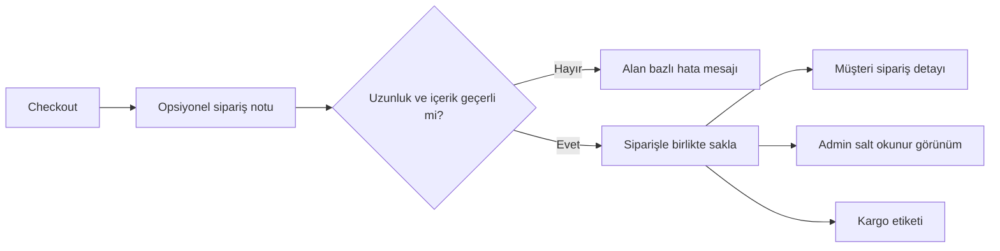

# Sipariş Notu — BA Vaka Çalışması

## Problem ve amaç

Müşteri teslimat veya hazırlama talimatını siparişle birlikte aktaramamaktadır. Amaç; checkout'ta opsiyonel not alanı sunmak, notu siparişle saklamak ve müşteri/admin/kargo etiketi kanallarında yalnızca okunabilir biçimde göstermektir.

## Analiz bulgusu

İlk talep metni **500 karakter**, detaylı gereksinimler ise **250 karakter** sınırı kullanmaktadır. Bu bir tutarsızlıktır. Portföy çözümü olarak değer varsayılmamış; Product Owner kararı bekleyen `NOTE-DEC-01` olarak kaydedilmiştir. Geçici test tasarımı 250 karakter üzerinden gösterilir.

## Süreç



## Gereksinimler

| ID | Gereksinim | Öncelik |
|---|---|---|
| NOTE-FR-01 | Checkout'ta opsiyonel sipariş notu alanı bulunmalıdır. | Must |
| NOTE-FR-02 | Not belirlenen karakter sınırını aşmamalıdır. | Must |
| NOTE-FR-03 | Not sipariş kaydıyla birlikte saklanmalıdır. | Must |
| NOTE-FR-04 | Not müşteri ve admin sipariş detayında görüntülenmelidir. | Must |
| NOTE-FR-05 | Not kargo etiketine güvenli biçimde aktarılmalıdır. | Must |
| NOTE-FR-06 | Sipariş sonrası müşteri ve admin notu değiştirememelidir. | Must |
| NOTE-NFR-01 | HTML/script içeriği güvenli biçimde reddedilmeli veya escape edilmelidir. | Must |
| NOTE-NFR-02 | Not alanı erişilebilir etiket ve karakter sayacına sahip olmalıdır. | Should |

## User stories

### NOTE-US-01 — Teslimat talimatı

```gherkin
Given müşteri checkout ekranındadır
When geçerli bir sipariş notu girip siparişi tamamlar
Then not siparişle birlikte saklanmalıdır
And sipariş detayında görüntülenmelidir
```

### NOTE-US-02 — Opsiyonel alan

```gherkin
Given müşteri checkout ekranındadır
When not alanını boş bırakır
Then sipariş başarıyla tamamlanabilmelidir
```

### NOTE-US-03 — Zararlı içerik

```gherkin
Given müşteri not alanına script içeriği girmiştir
When siparişi tamamlamaya çalışır
Then sistem zararlı içeriği çalıştırmamalıdır
And kullanıcıya güvenli bir doğrulama mesajı göstermelidir
```

## Test ve RTM

| Gereksinim | Test | Beklenen sonuç |
|---|---|---|
| NOTE-FR-01/03 | NOTE-TC-01 geçerli not | Not siparişle saklanır |
| NOTE-FR-01 | NOTE-TC-02 boş not | Sipariş tamamlanır |
| NOTE-FR-02 | NOTE-TC-03 sınır+1 | Hata mesajı; sipariş gönderilmez |
| NOTE-FR-05 | NOTE-TC-04 kargo etiketi | Not okunabilir ve taşma yapmaz |
| NOTE-FR-06 | NOTE-TC-05 admin düzenleme | Düzenleme aksiyonu bulunmaz |
| NOTE-NFR-01 | NOTE-TC-06 script içeriği | Kod çalışmaz; güvenli sonuç |

## Açık kararlar

| ID | Karar |
|---|---|
| NOTE-DEC-01 | Karakter sınırı 250 mi 500 mü? |
| NOTE-DEC-02 | Boş notta kargo etiketi alanı gizlenecek mi? |
| NOTE-DEC-03 | Kargo etiketi fiziksel alanı kaç karakter destekliyor? |
| NOTE-DEC-04 | Müşteri hizmetleri rolü notu görebilecek mi? |

## Wireframe

[Checkout sipariş notu ekranı](wireframes/order-note-checkout.svg)
