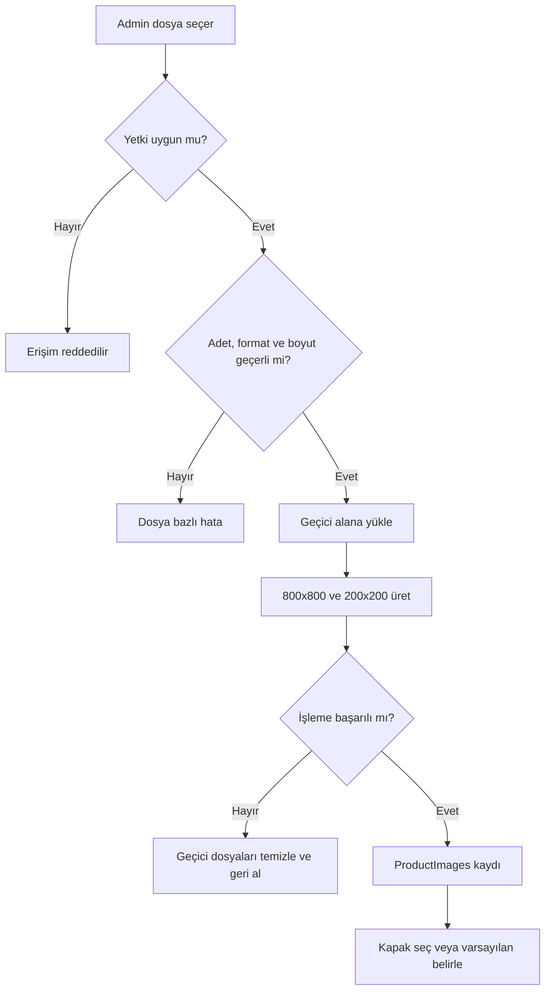
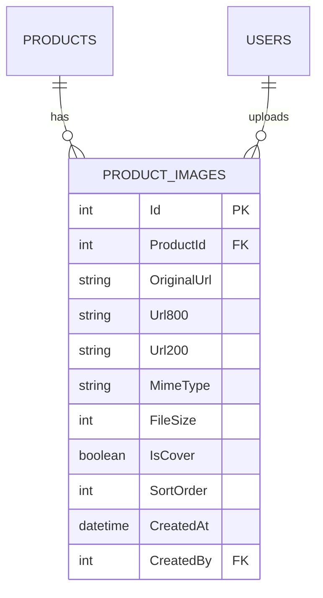

# Ürün Görseli Yönetimi — BA Vaka Çalışması

## Problem ve amaç

Admin kullanıcılar ürün görsellerini standart, kontrollü ve çoklu biçimde yönetememektedir. Amaç; ürün başına en fazla beş JPG/PNG/WEBP görseli, 2 MB sınırı, otomatik 800×800 ve 200×200 üretimi ve tek kapak görseli kuralını tanımlamaktır.

## Süreç



## Gereksinimler

| ID | Gereksinim | Öncelik |
|---|---|---|
| IMG-FR-01 | Yetkili admin ürüne görsel yükleyebilmelidir. | Must |
| IMG-FR-02 | Ürün başına en fazla 5 görsel olmalıdır. | Must |
| IMG-FR-03 | Yalnızca JPG, PNG ve WEBP kabul edilmelidir. | Must |
| IMG-FR-04 | Dosya başına sınır 2 MB olmalıdır. | Must |
| IMG-FR-05 | Tek kapak görseli seçilebilmelidir. | Must |
| IMG-FR-06 | Her görsel için 800×800 ve 200×200 sürümleri üretilmelidir. | Must |
| IMG-FR-07 | Admin görsel silebilmelidir; kapak silinirse yeni kapak belirlenmelidir. | Must |
| IMG-NFR-01 | MIME türü ve dosya imzası sunucu tarafında doğrulanmalıdır. | Must |
| IMG-NFR-02 | Başarısız resize işlemi yarım veri bırakmamalıdır. | Must |

## User stories

### IMG-US-01 — Çoklu görsel yükleme

```gherkin
Given yetkili admin ürün düzenleme ekranındadır
When geçerli iki görsel yükler
Then her görselin 800x800 ve 200x200 sürümü oluşmalıdır
And önizleme listesinde görünmelidir
```

### IMG-US-02 — Kapak seçme

```gherkin
Given üründe en az iki görsel vardır
When admin ikinci görseli kapak olarak seçer
Then yalnızca ikinci görsel IsCover=true olmalıdır
And ürün listesinde bu görsel görünmelidir
```

### IMG-US-03 — Geçersiz dosya

```gherkin
Given admin ürün düzenleme ekranındadır
When 2 MB üzeri veya desteklenmeyen dosya yükler
Then dosya kaydedilmemelidir
And dosyaya özel hata mesajı gösterilmelidir
```

## Veri modeli



## Test ve RTM

| Gereksinim | Test | Beklenen sonuç |
|---|---|---|
| IMG-FR-01/06 | IMG-TC-01 geçerli görsel | Kayıt + iki boyut |
| IMG-FR-02 | IMG-TC-02 altıncı görsel | İşlem engellenir |
| IMG-FR-03 | IMG-TC-03 PDF/GIF | Format hatası |
| IMG-FR-04 | IMG-TC-04 2 MB üzeri | Boyut hatası |
| IMG-FR-05 | IMG-TC-05 kapak seçimi | Tek IsCover=true |
| IMG-NFR-02 | IMG-TC-06 resize hatası | DB/dosya rollback |

## Açık kararlar

- Resize kırpma mı, oran koruma + padding mi kullanacak?
- Kapak seçilmezse ilk görsel otomatik kapak olacak mı?
- Görseller sürükle-bırak ile sıralanacak mı?
- Silinen dosyalar fiziksel depolamadan ne zaman kaldırılacak?
- Mevcut ürün görselleri için migration gerekli mi?

## Wireframe

[Admin ürün görseli yöneticisi](wireframes/product-image-manager.svg)
