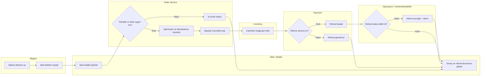
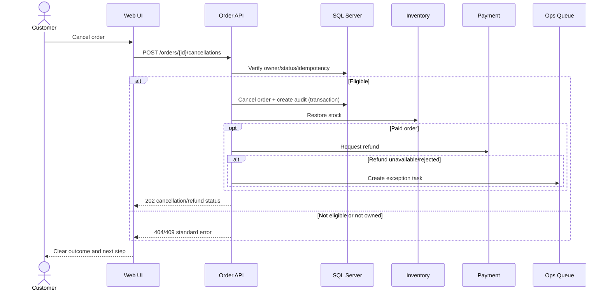

# BPMN/UML Süreç Spesifikasyonu

## TO-BE swimlane görünümü

## Sistem sequence diagramı

## BPMN olay ve gateway kataloğu

| Tür | Kimlik | Tanım |
|---|---|---|
| Start event | EVT-START-01 | Müşteri iptal aksiyonunu onaylar |
| Exclusive gateway | GW-ELIGIBILITY | Sahiplik, statü ve lojistik uygunluğu |
| Service task | TASK-CANCEL | Sipariş/audit transaction'ı |
| Service task | TASK-STOCK | Stok geri yükleme |
| Exclusive gateway | GW-PAID | Refund gereksinimi |
| Boundary/error | EVT-REFUND-ERROR | Payment timeout/rejection |
| End event | EVT-END-SUCCESS | İptal tamam, refund durumu görünür |
| End event | EVT-END-REJECTED | Kural nedeniyle veri değişmeden ret |

## Modelleme kuralları

- Gateway soruları tek ve ölçülebilir karar üretir.
- Sistem ve insan sorumlulukları lane'lerle ayrılır.
- Refund hatası sipariş iptal sonucunu belirsiz bırakmaz; operasyonel duruma yönlenir.
- Her bitiş olayı kullanıcı mesajı, audit sonucu ve ölçüm olayıyla eşleşir.
