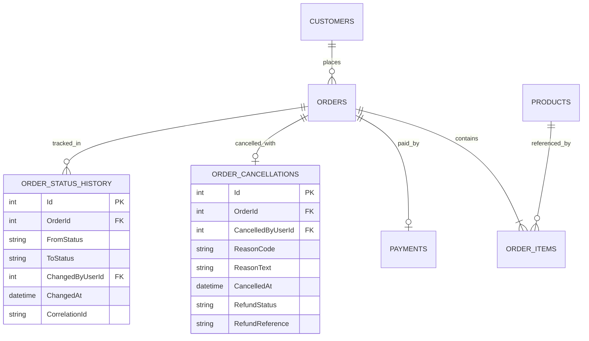

# Mantıksal Veri Modeli

## Tasarım kararları

- İptal bilgisi ayrı `OrderCancellations` tablosunda tutularak sipariş tablosunun sade kalması ve iptal sürecinin genişletilebilir olması önerilir.
- `OrderStatusHistory`, yalnızca son durumu değil değişiklik geçmişini de saklar.
- `OrderId` üzerinde unique kısıt, aynı sipariş için ikinci iptal kaydını engeller.
- Stok iadesi ve sipariş statüsü aynı transaction kapsamında işlenmelidir.
- Refund durumu sipariş durumundan ayrı izlenmelidir; sipariş iptal edilmişken iade operasyonu devam ediyor olabilir.
