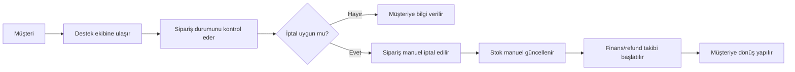
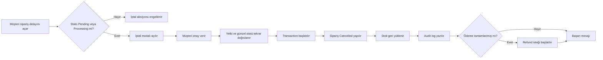
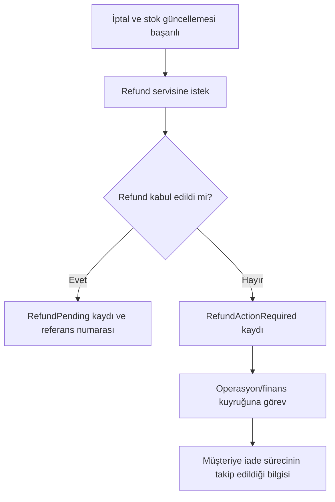
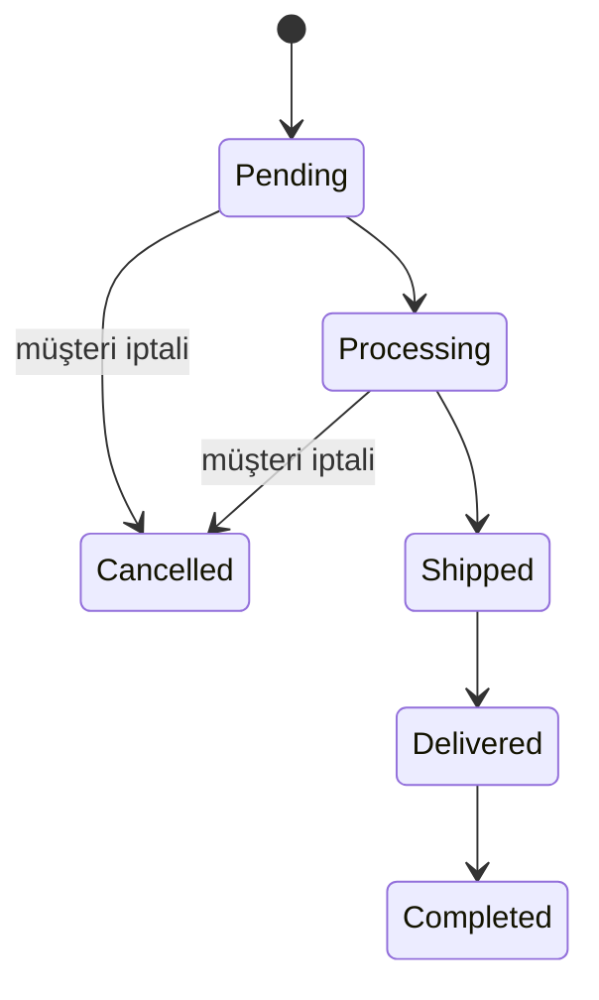

# Süreç Akışları

## AS-IS — Mevcut süreç

**Darboğazlar:** Destek bağımlılığı, uzun bekleme, manuel stok/refund adımları ve sınırlı izlenebilirlik.

## TO-BE — Önerilen süreç

## Refund hata akışı

## Durum geçişleri

